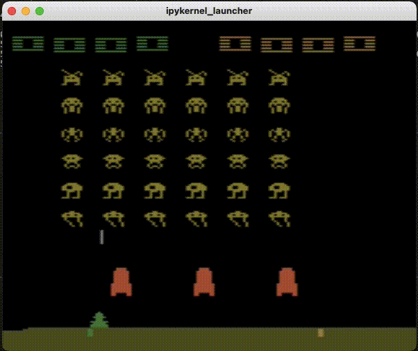

# Space Invader Keras RL

- Using Keras and Tensorflow to train an AI program to play Space Invader. 
- The simulation is provided by OpenAI's gym library.
- Applying Convolutional Neural Network and Reinforcement Learning to train the program.

## Demo

[Check out full Demo on YouTube](https://youtu.be/s5y04OGRI7w)

## Requirements

- Python 3.7
- Tensorflow
- Keras RL2
- Numpy
- Gym and Atari library
